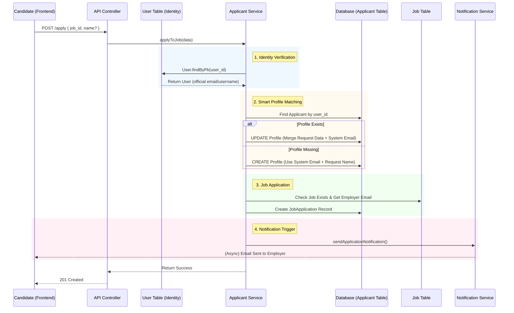
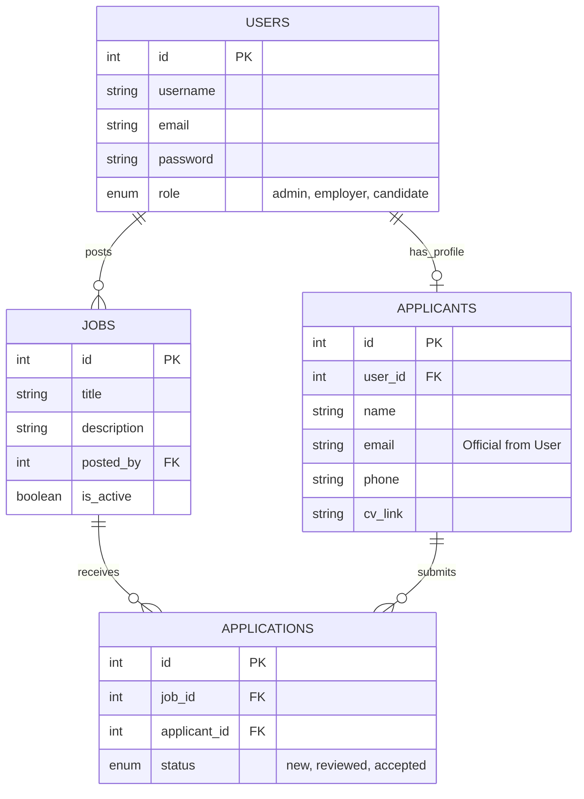

# Job Portal System Design

## 1. High-Level Design (HLD) - System Architecture
This diagram represents the major components and how they interact at a macroscopic level.

```mermaid
graph TD
    Client[Frontend Client (React/Next.js)] -->|HTTP Request| API[API Gateway / Server (Express)]
    
    subgraph Backend_Services
        API --> Auth[Auth Service]
        API --> User[User Service]
        API --> Job[Job Service]
        API --> App[Application Service]
        App --> Notify[Notification Service]
    end

    subgraph Database_Layer
        Auth -->|Read/Write| DB[(PostgreSQL Database)]
        User -->|Read/Write| DB
        Job -->|Read/Write| DB
        App -->|Read/Write| DB
    end

    Notify -->|SMTP| Email[Email Provider]
    Notify -->|b| Telegram[Telegram API]
```

---

## 2. Low-Level Design (LLD) - "Smart Application Flow"
This detailed flowchart visualizes the logic inside `application.service.ts` when a user applies for a job. It shows the **Extraction**, **Matching**, and **Creation** steps perfectly.



## 3. Database Schema Design (ERD)


